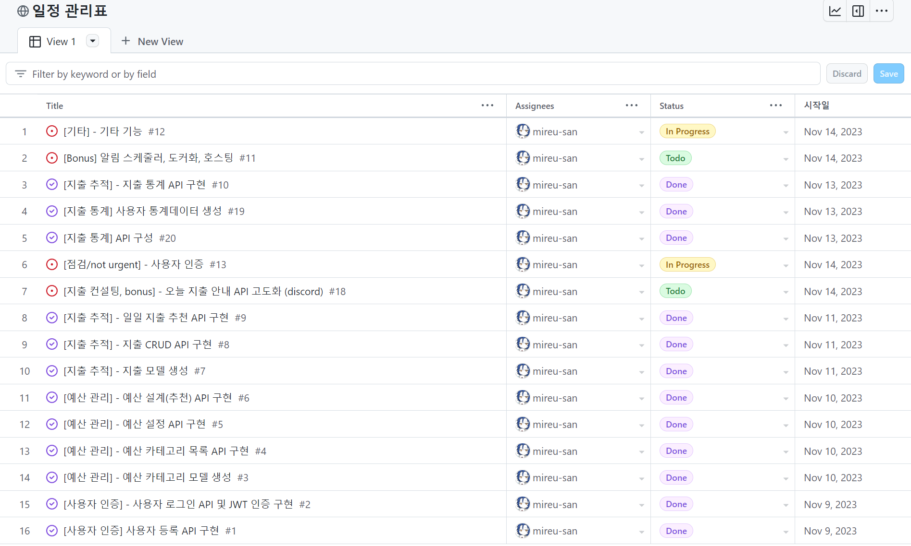

# Table of Contents
- [Table of Contents](#table-of-contents)
- [개요](#개요)
- [Skills](#skills)
      - [Language and Tool](#language-and-tool)
      - [Database](#database)
- [Directory](#directory)
- [API Reference](#api-reference)
- [ERD](#erd)
- [프로젝트 진행 및 이슈 관리](#프로젝트-진행-및-이슈-관리)
- [구현 설계 및 의도](#구현-설계-및-의도)
- [TIL \& 회고](#til--회고)

# 개요
해당 프로젝트는 '예산 관리 서비스' 를 구현하고 있습니다. 사용자의 개인 재무 관리 및 지출 추적을 토대로 재무 컨설팅 기능을 제공합니다. 사용자는 회원가입을 통해 서비스를 이용하고, 월별 예산 설정, 카테고리별 예산 설계, 지출 기록을 기반으로 개인 맞춤형 컨설팅 제공 및 지출 통계 기능이 포함됩니다.

# Skills
#### Language and Tool

#### Database

# Directory

눌러서 프로젝트 파일 구조 보기

<pre>
budget-mgt-service
├─ .gitignore
├─ assets
│  └─ images
│     ├─ moneydb.png
│     ├─ moneydb_erd.png
│     └─ swagger.png
├─ budget
│  ├─ admin.py
│  ├─ apps.py
│  ├─ migrations
│  │  ├─ 0001_initial.py
│  │  ├─ 0002_alter_budgetcategory_name.py
│  │  └─ __init__.py
│  ├─ models.py
│  ├─ serializers.py
│  ├─ tests.py
│  ├─ urls.py
│  ├─ views.py
│  └─ __init__.py
├─ core
│  ├─ asgi.py
│  ├─ settings.py
│  ├─ urls.py
│  ├─ wsgi.py
│  └─ __init__.py
├─ dummy.py
├─ LICENSE
├─ manage.py
├─ README.md
├─ requirements.txt
├─ stalker
│  ├─ admin.py
│  ├─ apps.py
│  ├─ migrations
│  │  ├─ 0001_initial.py
│  │  ├─ 0002_userpreferences_income_range_and_more.py
│  │  └─ __init__.py
│  ├─ models.py
│  ├─ serializers.py
│  ├─ tests.py
│  ├─ urls.py
│  ├─ views.py
│  └─ __init__.py
├─ swagger.py
└─ users
   ├─ admin.py
   ├─ apps.py
   ├─ manager.py
   ├─ migrations
   │  ├─ 0001_initial.py
   │  └─ __init__.py
   ├─ models.py
   ├─ serializers.py
   ├─ tests.py
   ├─ urls.py
   ├─ views.py
   └─ __init__.py
</pre>

# API Reference
Swagger : http://127.0.0.1:8000/

# ERD

# 프로젝트 진행 및 이슈 관리
아래 아이콘을 눌러 이슈 및 일정 관리 페이지 바로가기

# 구현 설계 및 의도

본 예산 관리 애플리케이션은 사용자가 자신의 재무 상황을 효과적으로 관리하고, 지출을 체계적으로 추적할 수 있도록 설계되었습니다. 이 앱의 주요 목적은 개인의 재무 목표 달성을 돕는 것입니다.

회원 가입

<pre>
본 애플리케이션에서는 간단한 회원가입 절차를 통해 사용자가 서비스를 이용할 수 있습니다. 사용자는 `계정명`과 `패스워드`를 입력하여 가입하며, 이후 JWT를 통한 인증 방식을 통해 안전한 서비스 이용이 가능합니다.
</pre>

예산 입력

<pre>
사용자는 월별 총 예산을 설정할 수 있으며, 다양한 지출 카테고리(예: 식비, 교통비 등)에 대해 예산을 배분할 수 있습니다. 시스템은 사용자가 예산 설정에 어려움을 겪을 때, 카테고리별 예산을 자동으로 추천하는 기능을 제공합니다.
</pre>

지출 트래킹 및 개인 맞춤형 컨설팅

<pre>
사용자는 지출 내역을 기록하고 이를 카테고리별로 관리할 수 있습니다. 애플리케이션은 월별 또는 주별 예산 설정을 기준으로 하여 현재 소비 가능한 금액을 안내하고, 매일 발생한 지출을 카테고리별로 분석해 제공합니다.
</pre>

Discord Webhook 알림 기능

<pre>
사용자는 매일 아침 예산 관련 정보를 Discord를 통해 받아볼 수 있는 옵션을 선택할 수 있습니다. 이는 사용자가 재정 관리에 더욱 적극적으로 참여하도록 독려하는데 유용합니다.
</pre>

# TIL & 회고
- [Django, Docker, Nginx: 정적 파일 로딩 이슈 해결 기록 일지](https://medium.com/@bellwoan/django-docker-nginx-%EC%A0%95%EC%A0%81-%ED%8C%8C%EC%9D%BC-%EB%A1%9C%EB%94%A9-%EC%9D%B4%EC%8A%88-%ED%95%B4%EA%B2%B0-%EA%B8%B0%EB%A1%9D-%EC%9D%BC%EC%A7%80-7954987b33ba)

- [Django — Unit Test 작성에서 겪은 이슈들](https://medium.com/@bellwoan/django-unit-test-%EC%9E%91%EC%84%B1%EC%97%90%EC%84%9C-%EA%B2%AA%EC%9D%80-%EC%9D%B4%EC%8A%88%EB%93%A4-ea4f7da18390)

- [Django — Unit test 작성과 절대경로](https://medium.com/@bellwoan/django-unit-test-%EC%9E%91%EC%84%B1%EA%B3%BC-%EC%A0%88%EB%8C%80%EA%B2%BD%EB%A1%9C-5c7f4d6dfea9)

- [Django에서 효율적인 데이터베이스 업데이트를 위한 패턴 고찰](https://medium.com/@bellwoan/django%EC%97%90%EC%84%9C-%ED%9A%A8%EC%9C%A8%EC%A0%81%EC%9D%B8-%EB%8D%B0%EC%9D%B4%ED%84%B0%EB%B2%A0%EC%9D%B4%EC%8A%A4-%EC%97%85%EB%8D%B0%EC%9D%B4%ED%8A%B8%EB%A5%BC-%EC%9C%84%ED%95%9C-%ED%8C%A8%ED%84%B4-%EA%B3%A0%EC%B0%B0-a3cdc2d22d8a)

- [Django — duplicated data issue 회피에는 get_or_create](https://medium.com/@bellwoan/django-duplicated-data-issue-%ED%9A%8C%ED%94%BC%EC%97%90%EB%8A%94-get-or-create-643a1c8d00c6)

- [Python, Django : dummy data 생성 후, 중복 처리하기](https://medium.com/@bellwoan/python-django-dummy-data-%EC%83%9D%EC%84%B1-%ED%9B%84-%EC%A4%91%EB%B3%B5-%EC%B2%98%EB%A6%AC%ED%95%98%EA%B8%B0-266a3b8fffba)