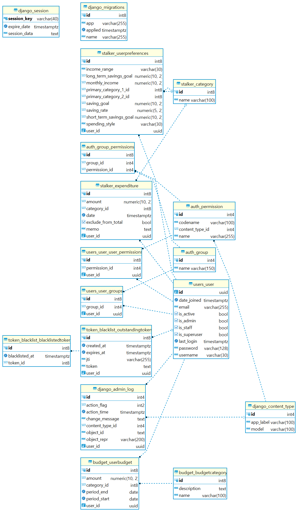

# budget-mgt-service
예산 관리 어플리케이션. Django 기반.
개발 기간: 23.11.09 ~ 23.11.14

# 개요
Users (회원), Budget(예산 관리), Stalker(지출내역 추적)로 분류하고, 사용자의 데이터 값을 토대로 피드백을 제공 및 추천을 합니다.

# ERD

# 일정 관리
[일정 관리(Github)](https://github.com/users/mireu-san/projects/5)

# TIL & 회고록
- [Django — Unit Test 작성에서 겪은 이슈들](https://medium.com/@bellwoan/django-unit-test-%EC%9E%91%EC%84%B1%EC%97%90%EC%84%9C-%EA%B2%AA%EC%9D%80-%EC%9D%B4%EC%8A%88%EB%93%A4-ea4f7da18390)

- [Django — Unit test 작성과 절대경로](https://medium.com/@bellwoan/django-unit-test-%EC%9E%91%EC%84%B1%EA%B3%BC-%EC%A0%88%EB%8C%80%EA%B2%BD%EB%A1%9C-5c7f4d6dfea9)

- [Django에서 효율적인 데이터베이스 업데이트를 위한 패턴 고찰](https://medium.com/@bellwoan/django%EC%97%90%EC%84%9C-%ED%9A%A8%EC%9C%A8%EC%A0%81%EC%9D%B8-%EB%8D%B0%EC%9D%B4%ED%84%B0%EB%B2%A0%EC%9D%B4%EC%8A%A4-%EC%97%85%EB%8D%B0%EC%9D%B4%ED%8A%B8%EB%A5%BC-%EC%9C%84%ED%95%9C-%ED%8C%A8%ED%84%B4-%EA%B3%A0%EC%B0%B0-a3cdc2d22d8a)

- [Django — duplicated data issue 회피에는 get_or_create](https://medium.com/@bellwoan/django-duplicated-data-issue-%ED%9A%8C%ED%94%BC%EC%97%90%EB%8A%94-get-or-create-643a1c8d00c6)

- [Python, Django : dummy data 생성 후, 중복 처리하기](https://medium.com/@bellwoan/python-django-dummy-data-%EC%83%9D%EC%84%B1-%ED%9B%84-%EC%A4%91%EB%B3%B5-%EC%B2%98%EB%A6%AC%ED%95%98%EA%B8%B0-266a3b8fffba)

# 관련 링크
작성 예정.